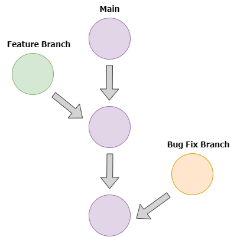
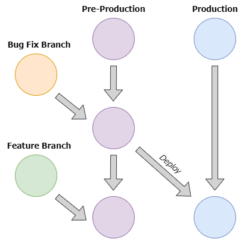

# Workflow
While the underlying Git technology powering GitHub and GitLab is virtually identical, these platforms advocate for the adoption of different workflows.

The recommended workflow for GitHub is to have a single main branch that is always ready for deployment. Additional features and bug fixes should be handled using separate branches created from the most recent version of the main branch. Once a feature or bug fix branch is tested, it is merged back into the main branch and thus immediately deployed. The GitHub workflow emphasizes speed and simplicity.

On the other hand, the GitLab recommended workflow is more intricate and involves the use of multiple “main” branches e.g., production, pre-production, release, etc. In the GitLab recommended workflow, feature and bug fix branches are created from the most current pre-production branch that includes the most recent changes (even if they are not live on production yet) and then merged back into the pre-production branch once tested. The pre-production branch is periodically merged into the production branch in the form of a release. The GitLab workflow emphasizes stability over speed, making ideal for largescale projects with a large userbase or sensitive data.

### The GitHub Recommended Workflow

### The GitLab Recommended Workflow

While you can technically opt for either workflow in both platforms, sticking to the recommended workflow makes your projects easier to use and augment for each platform’s respective community since the developers in each community will most likely be accustomed to the recommended workflow.